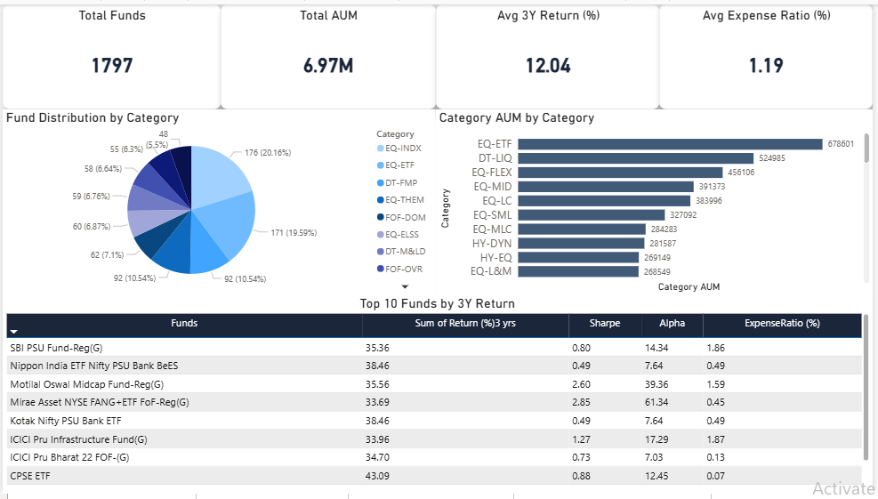
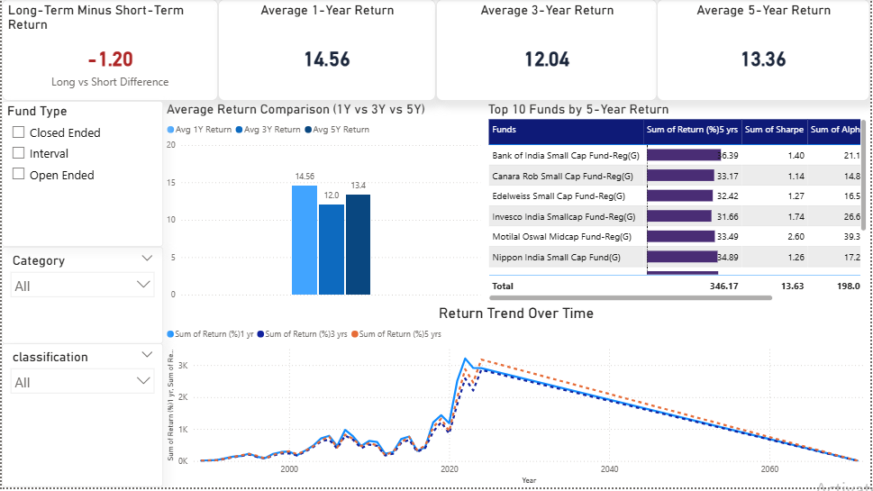
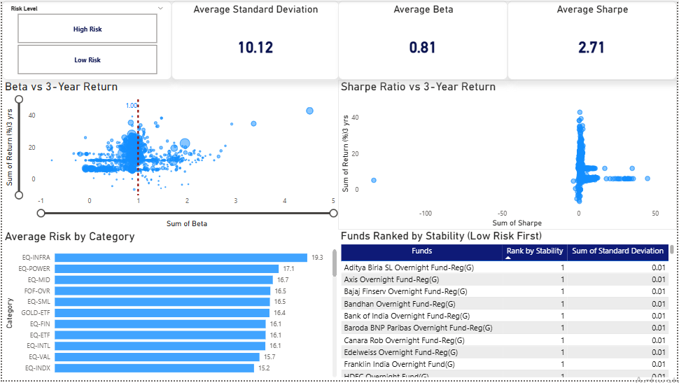
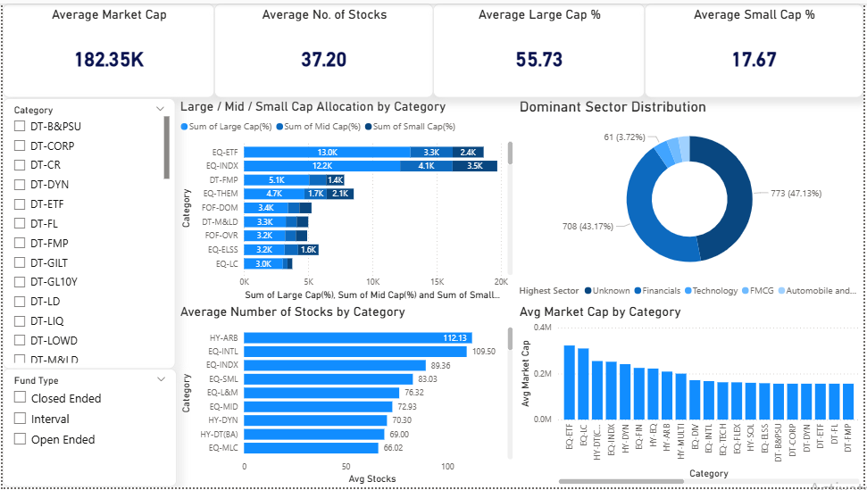
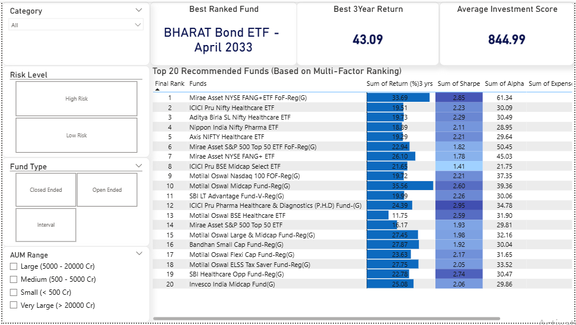

**📊 Mutual Fund Analysis Project (India – 2025)**

**🔹Project Overview**

This project presents an end-to-end data analysis of the **India Mutual Fund Dataset 2025** using** Python (Google Colab)** and **Power BI**. The goal is to analyze fund performance, risk, and portfolio composition, and build an interactive dashboard system for investment insights.

**🔹Dataset Details**

**Dataset Name**: Mutual Fund Dataset 2025

**Total Rows**: 1797

**Total Columns**: 37

**Key Columns**:

Fund Details: Funds, Fund Manager, Category, Fund Type

Financial Metrics: AUM (in Rs. Cr), NAV, Expense Ratio (%)

Returns: 1 Month, 3 Month, 6 Month, 1 Year, 3 Year, 5 Year, 10 Year

Risk Metrics: Beta, Standard Deviation, Sharpe, Sortino, Alpha

Portfolio: Large Cap (%), Mid Cap (%), Small Cap (%), Market Cap

Others: Benchmark Index, Exit Load Remarks, Inception Date

**🔹 Step 1: Data Cleaning & Preparation (Python - Google Colab)**

**Tasks Performed:**

Removed leading/trailing spaces from column names

Replaced missing value symbols ("-", "NA", "N/A") with NaN

Cleaned text columns and handled blank values

Converted percentage columns into numeric format

Converted "Inception Date" to datetime format

Fixed incorrect data types (float, integer, object)

Handled missing values:

Categorical → Filled with "Unknown"

Numeric → Filled using median/appropriate logic

Removed duplicate rows

**Output:**

Cleaned dataset saved as:

**cleaned_mutualfund_dataset.csv**

**🔹 Step 2: Data Visualization (Power BI)**

Created** 5 interactive dashboards** to analyze different aspects of mutual funds.

**🔹 Dashboard 1: Executive Overview**

**Purpose**: High-level summary of the dataset

**Key Visuals**:

Total Funds

Total AUM

Avg 3Y Return

Avg Expense Ratio

Fund Distribution by Category

AUM by Category

Top 10 Funds by 3Y Return

**🔹 Dashboard 2: Performance Analysis**

**Purpose**: Compare fund returns across different time horizons

**Key Visuals**:

1Y vs 3Y vs 5Y Return Comparison

Top Performing Funds

Return Trends

Long vs Short Term Performance Difference

**🔹 Dashboard 3: Risk & Volatility Analysis**

**Purpose**: Analyze risk-return relationship

**Key Visuals**:

Beta vs Return Scatter Plot

Sharpe Ratio Analysis

Risk Level Classification

Stability Ranking of Funds

**🔹 Dashboard 4: Portfolio Composition**

**Purpose**: Understand fund allocation and diversification

**Key Visuals**:

Large/Mid/Small Cap Allocation

Sector Distribution

Market Cap Analysis

Number of Stocks per Fund

**🔹 Dashboard 5: Ranking & Investment Insights**

**Purpose**: Identify best funds using multi-factor ranking

**Key Features**:

Ranking based on:

Returns

Risk (Beta, Std Dev)

Expense Ratio

Sharpe Ratio

Investment Score Calculation

Top 20 Recommended Funds

Best Ranked Fund Identification

**🔹 Tools & Technologies Used**

**Python (Pandas, NumPy)** → Data Cleaning

**Google Colab** → Development Environment

**Power BI** → Data Visualization & Dashboarding

**DAX** → Calculated Measures & Ranking Logic

**GitHub** → Project Hosting

**🔹 Key Insights**

Identified high-performing funds based on long-term returns

Analyzed relationship between risk and return

Evaluated cost efficiency using expense ratios

Compared portfolio allocation across fund categories

Built a ranking model for investment decision-making

**🔹 Files Included**

Mutual Fund Analysis.ipynb → Python data cleaning code

cleaned_mutualfund_dataset.csv → Final cleaned dataset

MutualFundDashboard.pbix → Power BI dashboard file

Dashboard screenshots → Preview of visualizations

**🔹 Dashboard Preview**

### Executive Overview

### Performance Dashboard

### Risk Dashboard

### Portfolio Dashboard

### Ranking Dashboard

**🔹 Conclusion**

This project demonstrates the complete workflow of a data analyst:

Data cleaning and preprocessing
Data transformation
Visualization and storytelling
Business insight generation

The dashboards provide actionable insights for investors to evaluate mutual funds based on performance, risk, and portfolio structure.
